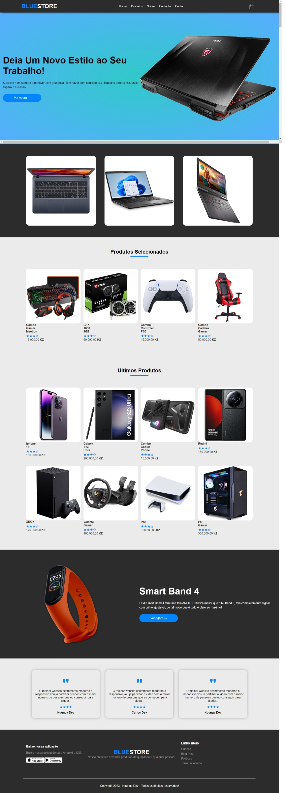

# BlueStore

BlueStore é um ecommerce, esse projecto foi mais aprendizado da "Uanela Como"


## licenses

Projecto de aprendizado: [shields.io](https://shields.io/)

[](https://choosealicense.com/licenses/mit/)
[](https://opensource.org/licenses/)
[](http://www.gnu.org/licenses/agpl-3.0)


## Deploy

Para fazer o deploy desse projeto rode

```bash
  apenas baixa o projecto, e executa index.hmtl
```

### Projecto
